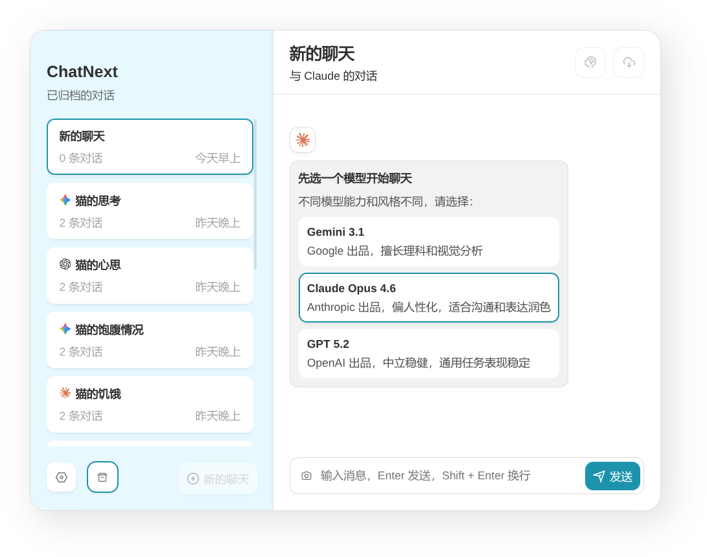

[NextChat](https://github.com/ChatGPTNextWeb/NextChat) 早期版本的 fork，主要给非技术用户使用。

- 避免花哨功能，如提示词商店和 MCP，RAG。模型选择只给主流模型。
- 维持无后端状态的设计，聊天内容保存在 `localStorage`。
- 使用 OpenRouter 提供主流模型支持。
- 增强中文支持，比如对 Gemini 英文思考过程会翻译。
- 对于小屏幕大字体界面有所考虑。



配置文件 `.env.local` 格式：

```
OPENAI_API_KEY=sk-...
OPENROUTER_API_KEY=sk-or-...
CODE=access-code
```
